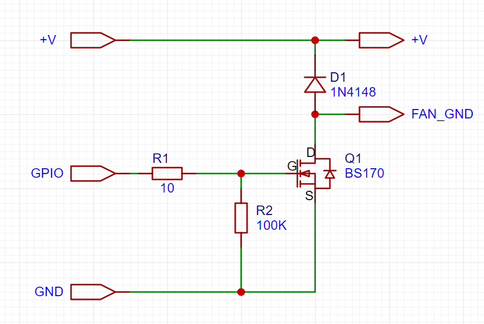

# Raspberry PI Security Camera 

Raspberry pi zero 2 w with a camera module 3 security system 
supports cloud upload to AWS S3 and direct MP4 encoding on the board,
fan control and storage cleanup

# Hardware:

https://www.raspberrypi.com/products/raspberry-pi-zero-2-w/ (with GPIO pins soldered) (PI shop)

https://www.raspberrypi.com/products/camera-module-3/ (should be: wide lens, with an infrared filter) (PI shop)

https://www.raspberrypi.com/products/camera-cable/ (22 to 15 pin camera cable, also available short cables on amazon) (PI shop, amazon, aliexpress)

HC-SR501 PIR Infrared Sensor or compatible from Arduino or any 5V 3 pins: +5V, signal pin, Ground (amazon, aliexpress)

30x10mm (or any) Blower Fan 5V 3 pins: +5V, control pin, Ground (this is very important, board will be not stable if fan is missing) (amazon, aliexpress)

install compatible CPU heatsink (amazon, aliexpress, PI shop)

box (amazon, aliexpress or 3D printed)

mounting leg (amazon, aliexpress or 3D printed)

Micro SD fast - A2 speed (amazon, costco - sandisk, amazon basics 128Gb or more)

Micro usb to USB cable (any dollarama)

# Micro SD card folders:

/camera - main folder with apps

/camera/capture - video capture folder

/camera/videos - local captured videos folder, but not uploaded

/camera/archive - uploaded archive folder

/camera/log - log folder

# File naming convention:

20240208232648-cam1-21.mp4

datetime stamp - cam name - motion detected seconds

# Apps

cameraconfig.py - main config, change S3 creds inside

camera.py - video recorder (time lapse 24/7 2FPS 1080p)

fan.py - CPU fan control

s3syncv2.py - S3 cloud storage sync

cleanup.py - sd card storage cleanup

remaining files are experimental for different video recording modes with motion detection

# Crontab config:

camera.py - on reboot

fan.py - on reboot

s3syncv2.py - every 5 min

cleanup.py - daily

sudo reboot - daily

sudo crontab -e

@reboot cd /home/usr/camera/ && python3 fan.py

@reboot cd /home/usr/camera/ && python3 camera.py

*/5 * * * * cd /home/usr/camera/ && python3 s3syncv2.py

0 * * * * cd /home/usr/camera/ && python3 cleanup.py

0 0 * * * sudo reboot

# Fan:

DC 5v fan with 3 pin or compatible with any 3 wire 5v control board +5V, GPIO control pin (17), Ground

or with DIY controller like this 3 pin to 2 pin fan

# PIR sensor:
compatible PIR sensor has 3 wires +5V, GPIO signal pin (4), Ground

PIR sensor has 2 potentiometers: 1 - detection sensitivity, 2 - sensor on duration, set comfortable sensitivity and minimum sensor on duration

# Raspberry PI settings

Install Raspberry Pi OS (Lite) using Raspberry Pi Imager on SD Card enable SSH and set password

https://www.raspberrypi.com/software/

On Raspberry pi zero 2 w only Lite OS version works stable due to low memory

insert sd card into Raspberry Pi attach power supply to correct micro usb port

check on router the IP address of the Raspberry Pi board, better to assign a static IP address on the router like 192.168.1.100 etc.

from PC open terminal, on Windows PowerShell as admin

type ssh (your board IP address), it will be something like ssh 192.168.1.100

enter board password previously set on SD card burning

it should connect to PI board

# Set swap size to 1024MB:

1. Temporarily Stop Swap:
sudo dphys-swapfile swapoff
2. Modify the size of the swap
As root, edit the file /etc/dphys-swapfile and modify the variable CONF_SWAPSIZE to 1024:
CONF_SWAPSIZE=1024
Using a command such as:
sudo nano /etc/dphys-swapfile
3. Initialize Swap File
sudo dphys-swapfile setup
4. Start Swap
sudo dphys-swapfile swapon

# Update PI

sudo apt-get update && sudo apt-get upgrade -y && sudo apt-get autoremove

# AWS S3 Cloud Storage Config

https://aws.amazon.com/console/

Setup AWS API user what has permissions to write to S3 using this policy

open AWS Console, IAM -> Policies -> create new policy 'Cameras' using this JSON
{
    "Version": "2012-10-17",
    "Statement": [
        {
            "Sid": "VisualEditor0",
            "Effect": "Allow",
            "Action": [
                "s3:PutObject",
                "s3:GetObject",
                "s3:ListBucket",
                "s3:GetBucketLocation"
            ],
            "Resource": "*"
        }
    ]
}

open AWS Console, IAM -> Users -> Create new user 'camuser'
 
select User 'camuser' -> Permissions -> Permissions policies -> Add previously created policy 'Cameras' to this user
 
User -> Security credentials -> Access Keys -> Create Access Key (key_id and secret) region is the S3 bucket region
 
open AWS Console, open S3 -> create bucket, specify name and all settings by default, do not make it public
 
open S3 bucket -> Management -> Lifecycle rules -> Create Lifecycle rule, specify name, check box expire current versions after X days, this will automaticaly delete old files after X days

# Modify cameraconfig.py

add credentials for S3 storage

# Copy project files

download project from git or clone repository using git

to copy files directly using WinSCP or any sftp client connect to the PI board user@192.168.1.100 on port 22

Copy project files to home\user\camera and folders mentioned above

you can also use git directly

sudo apt-get install git

cd camera

git init

git clone (project)

# Update python libs

Update python dependencies, could be more, please check errors if missing something

boto3, ffmpeg, picamera2

sudo pip3 install (dependency)

# Test apps 

Connect Camera via camera cable

test apps using 

cd camera

sudo python3 camera.py 

it should start recording into capture folder in batches of 5 minutes 

camera should be connected and all dependencies installed

applications also can be tested using screen for multiple sessions in the same time

run all apps in the same time

install screen

sudo apt-get screen

screen
type here your commands
CTRL - A, CTRL - D

to list sessions
screen -ls 

to connect to the session 
screen -r (session you like)

